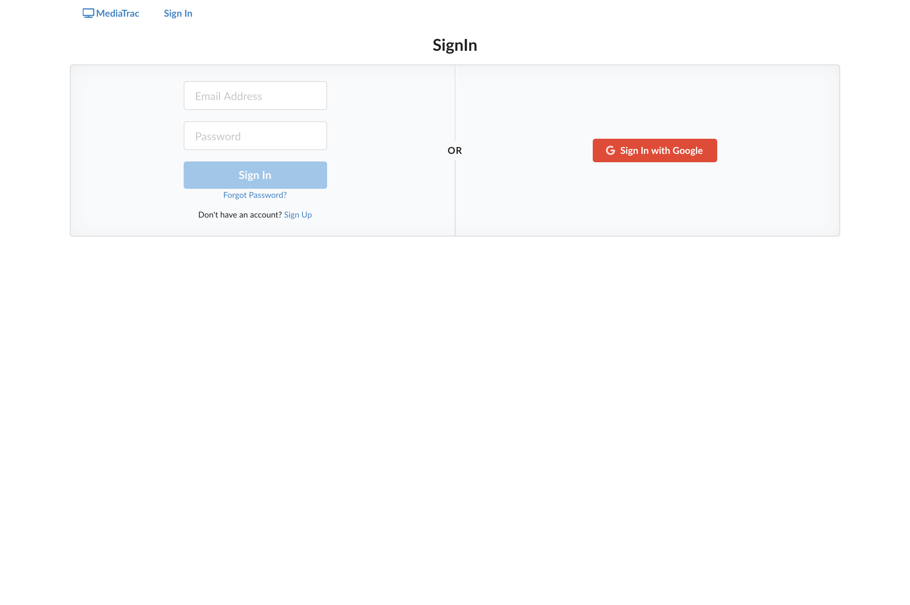

# Mediatrac

Mediatrac is a travel discovery engine providing information about landmarks, experiences, and restaurants for films around the globe

[Link to Live Demo](https://mediatrac-app.herokuapp.com/)

[Link to Backend API](https://github.com/415CA/mediatrac-backend)


## Table of Contents
* [Getting Started](#getting-started)
* [Features](#features)
* [Tech Stack](#tech-stack)
* [APIs](#apis)
* [Tools](#tools)

<a name="getting-started"/>

## Getting Started
1. Install [Rails Backend API](https://github.com/415CA/turismo-backend)
2. Install [Node.js and npm](https://www.npmjs.com/get-npm)

    ```$ brew install node```
    
3. Clone this repo and cd into the directory
4. Install all dependencies

    ```$ npm install```

5. Create a [Firebase](https://console.firebase.google.com/u/0/) project with your Google Account 
6. Create an .env file in the React project's root folder with the following info from your Firebase settings.
    ```
    REACT_APP_API_KEY=XXXXxxxx 
    REACT_APP_AUTH_DOMAIN=xxxxXXXX.firebaseapp.com
    REACT_APP_DATABASE_URL=https://xxxXXXX.firebaseio.com
    REACT_APP_PROJECT_ID=xxxxXXXX
    REACT_APP_STORAGE_BUCKET=xxxxXXXX.appspot.com
    REACT_APP_MESSAGING_SENDER_ID=xxxxXXXX
    REACT_APP_CONFIRMATION_EMAIL_REDIRECT=http://localhost:3000
    ```
7. Add an API key from [The Movie Database (TMDb) API](https://developers.themoviedb.org/3)  to the .env file
    ```
    REACT_APP_TMDB_API_KEY=XXXXX
    ```
8. Make sure the Rails server is running and then run the app

    ```$ npm start```
    
<a name="features"/>

## Features

### Search Films

Search from over half a million titles in the TMDB database


### Films
Each film page contains a description, cast and crew information, trailers, social media links, a NY Times review, and user reviews

Details Page


Trailers


Recommended Films 


### Favorite Films
Users can keep track of their favorite films through the My Movies watchlist.


### New Releases
The New Release page gives you a list of the latest film releases broken down by genre. 


### Auth & Account Features
Log in via email and password or existing Google account with [Firebase Authentication](https://firebase.google.com/docs/auth)



<a name="tech-stack"/>

## Tech Stack
* React.js
* Ruby on Rails API (Backend: https://github.com/415CA/mediatrac-backend)
* Firebase
* PostgreSQL
* HTML
* CSS
* Semantic UI
* Active Record
* Active Model Serializer

<a name="apis"/>

## API
* [The Movie Database (TMDb) API](https://developers.themoviedb.org/3)
* [NY Times](https://developer.nytimes.com/apis)

<a name="tools"/>

## Tools
* [Axios](https://www.npmjs.com/package/react-axios)
* [ActiveModel::Serializer](https://github.com/rails-api/active_model_serializers)
* [Rack CORS](https://github.com/cyu/rack-cors)
* [React Slick Carousel](https://www.npmjs.com/package/slick-carousel)
* [React Router](https://reacttraining.com/react-router/web/guides/quick-start)
* [Styled Components](https://styled-components.com/)
